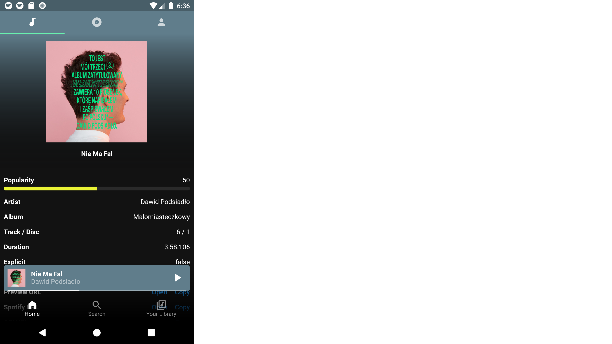

# Statify: Statistics for Spotify

This is a Flutter application for Android platform.

Due to Spotify's quota the app is **not** available in Google Play\*, but you can generate an `apk` yourself. All you need to do is create an app in https://developer.spotify.com/dashboard/applications and create a `.env` file in the project root directory with the following variables:

* CLIENT_ID
* REDIRECT_URL

Then use e.g. Android Studio to generate the `apk`. Have fun!

Developed with **Flutter 2.10.3** and **Dart 2.16.1**.

Tested with Spotify 8.7.32.1554 on:

* Android 8.0 (Pixel 2, emulator)
* Android 10 (OnePlus 7T, physical)

\* because the app is currently in development mode and thus I need to personally add every single user, and I'm afraid I wouldn't get quota extension.
